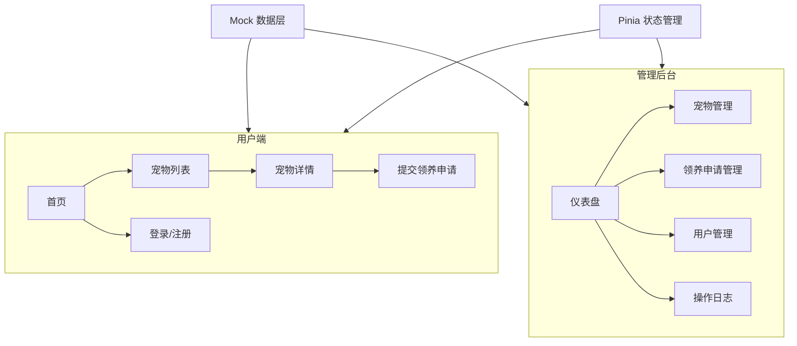
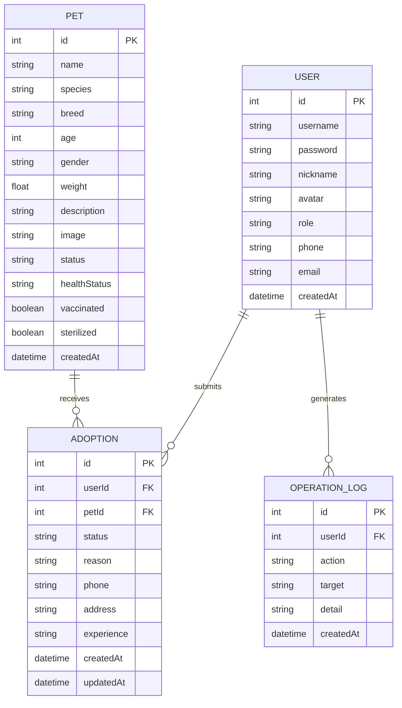

# 项目设计文档 - 宠物领养平台

## 1. 系统架构

## 2. 数据模型

## 3. 接口清单

> 纯前端项目，以下为 Mock 模拟接口定义，数据由本地 Mock 提供。

**认证模块**
- [POST] /api/auth/login - 用户登录
- [POST] /api/auth/register - 用户注册
- [GET] /api/auth/profile - 获取用户信息

**宠物模块**
- [GET] /api/pets - 获取宠物列表（支持分页、筛选）
- [GET] /api/pets/:id - 获取宠物详情
- [POST] /api/pets - 新增宠物（管理员）
- [PUT] /api/pets/:id - 更新宠物（管理员）
- [DELETE] /api/pets/:id - 删除宠物（管理员）

**领养模块**
- [GET] /api/adoptions - 获取领养申请列表
- [POST] /api/adoptions - 提交领养申请
- [PUT] /api/adoptions/:id - 审批领养申请（管理员）

**用户管理模块**
- [GET] /api/users - 获取用户列表（管理员）
- [PUT] /api/users/:id/status - 更新用户状态（管理员）

**操作日志模块**
- [GET] /api/logs - 获取操作日志列表（管理员）

## 4. 页面清单

| 页面 | 路径 | 功能描述 |
|------|------|---------|
| 首页 | / | 平台介绍、精选宠物展示、搜索入口 |
| 宠物列表 | /pets | 宠物卡片列表，支持物种/年龄/性别筛选 |
| 宠物详情 | /pets/:id | 宠物信息、健康状况、领养按钮 |
| 登录 | /login | 用户登录 |
| 管理仪表盘 | /admin | 统计概览（总宠物数、待领养、已领养、待审批） |
| 宠物管理 | /admin/pets | 宠物 CRUD、状态管理 |
| 领养管理 | /admin/adoptions | 审批领养申请 |
| 用户管理 | /admin/users | 用户列表、状态管理 |
| 操作日志 | /admin/logs | 操作日志查看 |

## 5. 示例数据规划

- **宠物数据**：8 条（涵盖猫、狗、兔子等，包含不同年龄、性别、状态）
- **用户数据**：4 条（admin + 3 普通用户）
- **领养申请**：6 条（涵盖待审批、已通过、已拒绝三种状态）
- **操作日志**：8 条
- **统计数据**：由 Mock 数据实时计算，仪表盘展示宠物统计和领养趋势
- 数据载体：`frontend/src/mock/` 目录下的 TypeScript 文件，随应用加载注入

## 6. 前端设计规范

### 6.1 设计方向
- 美学风格：自然有机 + 温暖柔和，传递宠物领养的温情与信任感
- 设计关键词：温暖、自然、信赖、亲和、生命力

### 6.2 色彩体系
- **主色 (Primary)**：`#FF8C42` — 温暖橙色，用于主按钮、导航高亮、重点信息
- **辅色 (Secondary)**：`#4ECDC4` — 清新青绿色，用于辅助按钮、标签、图标
- **强调色 (Accent)**：`#FF6B6B` — 珊瑚红色，用于通知徽标、重要提示、收藏
- **中性色阶梯**：
  - 50: `#FBF8F4` / 100: `#F5F0E8` / 200: `#EDE5D8` / 300: `#DDD3C2` / 400: `#BFB3A0` / 500: `#9C8E7C` / 600: `#7A6E5E` / 700: `#5C5244` / 800: `#3D372E` / 900: `#231F1A` / 950: `#121010`
- **语义色**：
  - Success: `#27AE60` / Warning: `#F39C12` / Error: `#E74C3C` / Info: `#3498DB`
- 60-30-10 法则：60% 暖白底色 → 30% 中性暖灰 → 10% 橙色强调

### 6.3 字体体系
- **标题字体**：Nunito (Google Fonts) — 圆润友好
- **正文字体**：Noto Sans SC (Google Fonts) — 清晰易读的中文字体
- **字号阶梯**：xs(12px) / sm(14px) / base(16px) / lg(18px) / xl(20px) / 2xl(24px) / 3xl(30px) / 4xl(36px)
- **行高**：正文 1.6 / 标题 1.2-1.3
- **字重**：Regular(400) / Medium(500) / Semibold(600) / Bold(700)

### 6.4 间距与布局
- 基准单位：4px
- 间距阶梯：4 / 8 / 12 / 16 / 24 / 32 / 48 / 64
- 栅格系统：12 列，间距 24px，最大宽度 1280px
- 响应式断点：sm(640px) / md(768px) / lg(1024px) / xl(1280px)

### 6.5 组件规范
- 圆角：sm(6px) / md(10px) / lg(16px) / xl(24px) / full(9999px)
- 阴影层级：
  - sm: `0 1px 3px rgba(0,0,0,0.08)`
  - md: `0 4px 12px rgba(0,0,0,0.1)`
  - lg: `0 8px 24px rgba(0,0,0,0.12)`
  - xl: `0 16px 48px rgba(0,0,0,0.15)`
- 边框：`1px solid var(--color-neutral-200)`
- 卡片：白色背景 + md 圆角 + sm 阴影 + hover 时 lg 阴影

### 6.6 动效规范
- 过渡时长：快 150ms / 中 250ms / 慢 400ms
- 缓动函数：`cubic-bezier(0.4, 0, 0.2, 1)`（标准），`cubic-bezier(0, 0, 0.2, 1)`（减速）
- 三层动效：
  - 页面级：路由切换 fade+slide 过渡、首屏交错入场
  - 区块级：卡片入场 fadeInUp、列表交错延迟 80ms
  - 元素级：按钮 hover 微上移+阴影增强、输入框 focus 边框高亮

### 6.7 平台适配说明
- 目标平台：Web 浏览器端
- 鼠标 hover + 键盘交互
- 自适应宽度，最小支持 375px 移动端

### 6.8 图片与媒体资源清单
- 首页 Banner：1 张，关键词「宠物 温馨 家庭」
- 宠物列表图：8 张（4 猫 + 3 狗 + 1 兔子），关键词「可爱 宠物 高清」
- 空状态插图：使用 SVG 图标组合
